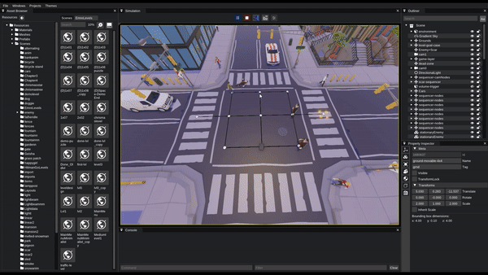
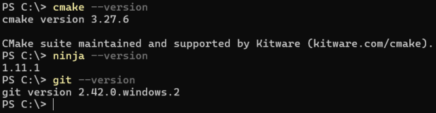
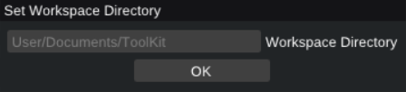
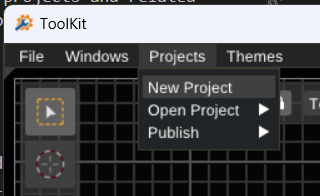
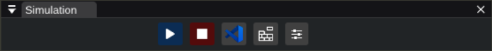

# ToolKit

ToolKit is a 3d editor & interactive application development platform. It allows users to create 3d scenes and bring in the interactivity via C++ plug-ins.

## Motivation

### Simplicity

Most games, projects using Unity, Unreal Engine or even Godot, don't need all those tools and functionalities. Having a far simpler game engine, increases your comprehension of the framework & tools, which in return gives you more freedom to do things your way. This approach may not be suitable for professional game studios, however it is very suitable for indies who are after unique projects.

This project has a unique goal which is keeping all the source code under 50k lines of code excluding dependencies. Instead of adding more capabilities, tools and getting more complicated, ToolKit will be oriented towards simplicity, performance and being/staying modern.

### Community

Bringing like minded people together around a project outputs invaluable assets as one can observe from projects like Blender & Godot. So the project's motivation is to bring people together who are after uniqueness, simplicity, modernity and collaborative effort to create something exceptional.

## Platforms

ToolKit does not have any Windows dependency and can be built for Linux and Mac easily. However the main OS is Windows for the Editor.

ToolKit can publish for:

- Windows exe
- Web html + .wasm or .js
- Android apk

All the publishing can be achieved from within the editor via click of a button. However for publishing to given platforms there are required configurations steps and installments such as emscripten and android sdk.



## Projects Using ToolKit


[**Multiverse Go**](https://store.steampowered.com/app/2346880/Multiverse_GO/)

Multiverse GO is a turn-based puzzle adventure set in a group of multiple universes. You can explore the multiverse and face challenges. The game focuses on forward thinking to progress through levels. Check out the link for more visuals from the project.

**Don't Forget to Wishlist the Game in Steam !**

## Compiling

#### Requirements
* Visual Studio 2022 or newer.
* Visual Studio Code
* Visual Studio Code C/C++ Extension Pack
* Ninja build system
* Git SCM

Its important to set environment path such that git, cmake and ninja commands are recognized from consoles as in the screen shot below.



#### Compile Steps

* Clone the repo recursively.
```bash
git clone --recursive https://github.com/Oyun-Teknolojileri/ToolKit.git
```
* Run build dependency script.
```bash
cd .\ToolKit\
cd .\DependencyBuildScripts\
.\BuildAllDependencies.bat
```

After this point ToolKit/ToolKit.sln file can be open and build.

#### Visual Studio Project Overview

Visual Studio 2022 with C++ tools is required to compile the engine and the editor. The solution is in the main directory of the ToolKit repository called ToolKit.sln. The Solution contains two main filters, Engine and Projects. Within the Engine filter, game engine, editor and related tools are residing. Before running the Editor, make sure that you have set it as the startup project. All required dependencies are residing in the Dependencies folder. Don't forget to init and update git submodules. Finally run BuildAllDependencies.bat to compile all dependencies.

There are cmake files all around the repository and .bat files in the BuildScripts folder. They are used to compile the engine and the projects for target environments Web, Android and PC. You don't need to directly call these cmake files. All outputs can be compiled and packed within the editor. However cmake files are well documented for more advanced usages and configurations.


## Setup

After compiling the ToolKit solution, it creates the editor.exe in the Bin folder. When running the editor for the first time it asks a folder to use as a workspace directory. Its reasonable to give it a folder in the documents where you have full read & write access. All projects and related files get stored under the workspace / project folder. A sample path for workspace 
> "C:/Users/**YourUserName**/Documents/TK-Workspace"



After setting the workspace directory, "%appdata%/ToolKit/Config" path is filled with initial settings and all the states for the editor are saved here. When you need to reset settings for troubleshooting purposes, feel free to remove the %appdata%/ToolKit directory. It will be created with default settings.

## Creating A New Project

You can use the Main menu bar in the editor to create a new project. The project and required files will all be created in the workspace automatically. The project name must consist of ASCII alphanumeric characters without any whitespace. Publish name can be anything but the project name has this requirement.



Visual Studio Code (VSCode) is the default code editor used by the ToolKit. You'll need to install it to write game / application codes. Also VSCode C/C++ Extension Pack must be installed.

In order to see the project's code folder and start development, you can press the VSCode icon in the Simulation window. It will open the "Workspace/Project/Codes" folder in VSCode with boiler plate codes to let you start development immediately. You can compile the project from the editor by pressing the Build button in the Simulation window ( next to VSCode icon ) or just compile it in the VSCode itself. Then you can press the play button to run the simulation in the editor. In VSCode you can compile the project with F7 also you can attach the VSCode to the ToolKit Editor to debug your codes when you are running the simulation from the editor.



## Dependencies
- stb_image - MIT 
- SDL 2.0 - Zlib
- rapidxml - MIT
- MiniAudio - MIT
- glm - MIT
- glad - MIT
- Dear imgui - MIT
- Assimp - BSD
- Zlib - Zlib

## License

 Source code is dual-licensed. It is available under the terms of the GNU Lesser General Public License v3.0 (LGPL-3.0) for open-source use. Additionally, we offer a proprietary license with more permissive terms suitable for commercial applications.
 For information on using the open-source LGPL v3 license, please refer to the accompanying LICENSE file. If you require a more flexible commercial license for proprietary projects or custom development, please contact us for personalized licensing terms and conditions. 

 [OtSoftware](https://www.otyazilim.com)
 
## Final Words

Project is in active development. Feel free to play around with it and get in touch with [us](https://www.otyazilim.com)

Enjoy!
