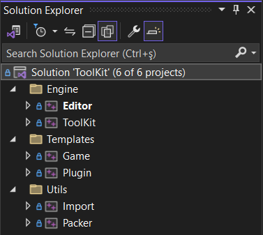

# ToolKit

ToolKit is a 3d editor & interactive application development platform. It allows users to create 3d scenes and bring in the interactivity via C++ plug-ins.

## Motivation

### Simplicity

Most games, projects using Unity, Unreal Engine or even Godot, don't need all those tools and functionalities. Having a far simple game engine, increases your comprehension of the framework & tools, which in return gives you more freedom to do things your way. This approach may not be suitable for professional game studios, however it is very suitable for indies whom after unique projects.

This project has a unique goal which is keeping all the source code under 50k lines of code excluding dependencies. Instead of adding more capabilities, tools and getting more complicated, ToolKit will be oriented towards simplicity, performance and being/staying modern.

### Community

Bringing like minded people together around a project outputs invaluable assets as one can observe from projects like Blender & Godot. So the project's motivation is to bring people together who after uniqueness, simplicity, modernity and collaborative effort to create something exceptional.

## Platforms

ToolKit does not have any Windows dependency and can be build for Linux and Mac easily. However the main OS is Windows for the Editor.

ToolKit can publish for:

- Windows exe
- Web html + .wasm or .js
- Android apk

All the publishing can be achieved from within the editor via click of a button. However for publishing to given platforms there are required configurations steps and installments such as emscripten and android sdk.

  

## Compiling

Visual Studio 2022 with C++ tools is required to compile the engine and the editor. The solution is in the main directory of the ToolKit repository called ToolKit.sln. The Solution contains two main filters, Engine and Projects. Within the Engine filter, game engine, editor and related tools are residing. Before running the Editor, make sure that you have set it as the startup project. All required dependencies are residing in the Dependencies folder in a precompiled form.

There are cmake files all around the repository and .bat files in  BuildScripts folder. They are used to compile the engine and the projects for target environments Web, Android and PC. You don't need to directly call these cmake files. All outputs can be compiled and packed within the editor. However cmake files are well documented for more advanced usages and configurations.

## Dependencies
- stb_image - MIT 
- SDL 2.0 - Zlib
- rapidxml - MIT
- MiniAudio - MIT
- glm - MIT
- glad - MIT
- Dear imgui - MIT
- Assimp - BSD
- Zlib - Zlib

## License

 Source code is dual-licensed. It is available under the terms of the GNU Lesser General Public License v3.0 (LGPL-3.0) for open-source use. Additionally, we offer a proprietary license with more permissive terms suitable for commercial applications.
 For information on using the open-source LGPL v3 license, please refer to the accompanying LICENSE file. If you require a more flexible commercial license for proprietary projects or custom development, please contact us for personalized licensing terms and conditions. 

 [OtSoftware](https://www.otyazilim.com)
 
## Final Words

Project is in active development. Feel free to play around with it and get in touch with [us](https://www.otyazilim.com)

Enjoy!
